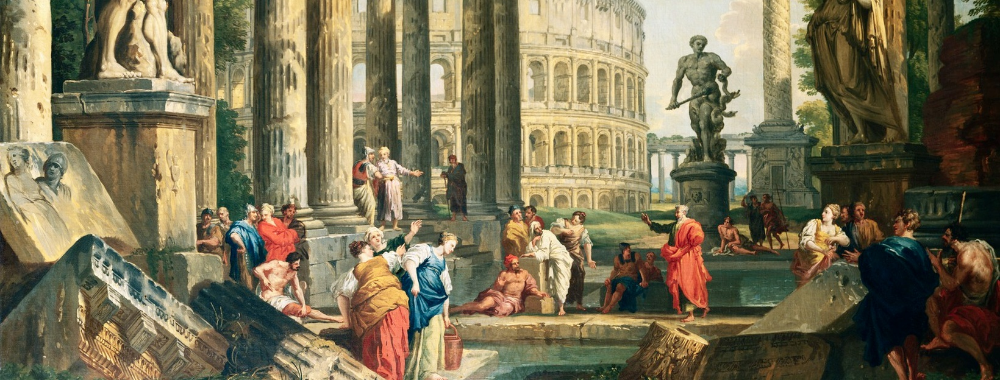

import Bleed from 'nextra-theme-docs/bleed'

<Bleed></Bleed>*A Capriccio of Classical Ruins by
Giovanni Paolo Panini (1730)*

---

# DAOs

Decentralized Autonomous Organizations (or DAOs) are collectives of users on blockchains like Ethereum with a shared mission. DAOs are kind of the blockchain equivalent of an LLC, but with several key differences:

- DAOs are usually created around a native token (as an example, everyone in the [Friends with Benefits](http://fwb.help) DAO holds the \$FWB token). This is to both keep track of who is in the DAO and allow any value that the DAO accrues (the token's price going up) to be shared with every member
- Collectively owned and managed by its members. Decisions are governed by proposals and voting to ensure everyone in the organisation has a voice
- All political activity (voting, token allocations, proposals) are completely public and transparent as they are stored on the blockchain
- DAOs are automatically global from day one — anyone anywhere can become a part of one

You can learn more about DAOs in the articles below.

- [A beginner's guide to DAOs](https://linda.mirror.xyz/Vh8K4leCGEO06_qSGx-vS5lvgUqhqkCz9ut81WwCP2o)

- [Decentralized autonomous organizations (DAOs)](https://ethereum.org/en/dao/)

- [What Is A DAO And How Do They Work?](https://consensys.net/blog/blockchain-explained/what-is-a-dao-and-how-do-they-work/)

- [Community DAOs](https://p.mirror.xyz/cVN3KOss0uqpZwxHQKtC4Syvn1RfXaxofFKHJuKLWS4)

- [DAO Landscape](https://coopahtroopa.mirror.xyz/_EDyn4cs9tDoOxNGZLfKL7JjLo5rGkkEfRa_a-6VEWw)

- [What is a DAO in Crypto?](https://www.youtube.com/watch?v=KHm0uUPqmVE)
