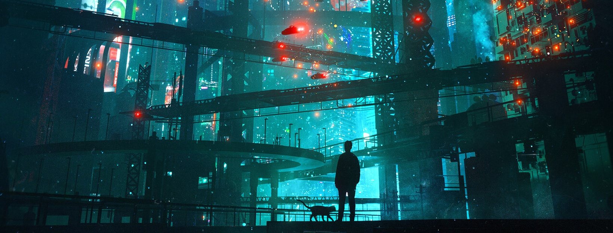

import Bleed from 'nextra-theme-docs/bleed'

<Bleed></Bleed>*"Back Home", NFT by Danguiz (2021)*

---

# Primer: Crypto 101

You are reading this primer because you're a smart and curious person looking to learn more about crypto but don't really know where to begin. Perhaps you were sent here by a friend who is further down the rabbit hole than you, or you found your way here all on your own. In either case, welcome.

You've googled the buzzwords, perhaps watched a video or two about crypto, but so far things haven't really clicked. Yet you can feel that something important is happening.

I've compiled this document to hopefully serve you as a roadmap and guide. I won't be writing too much of it myself — there are far smarter people who already articulated these concepts much better than I ever could. I plan to simply compile all the best sources in a single place that is easy to parse through and share with others.

This is an ever-evolving aggregation of links, videos, articles, explainers, etc. Crypto is a moving target — I will try and keep this up to date as much as possible, but ideally after learning the foundations you will be informed enough to be able to take ownership of your own journey.

A warning: the rabbit hole is extremely deep, possibly endless. And once it hits, it's hard to think of anything else. Good luck.
